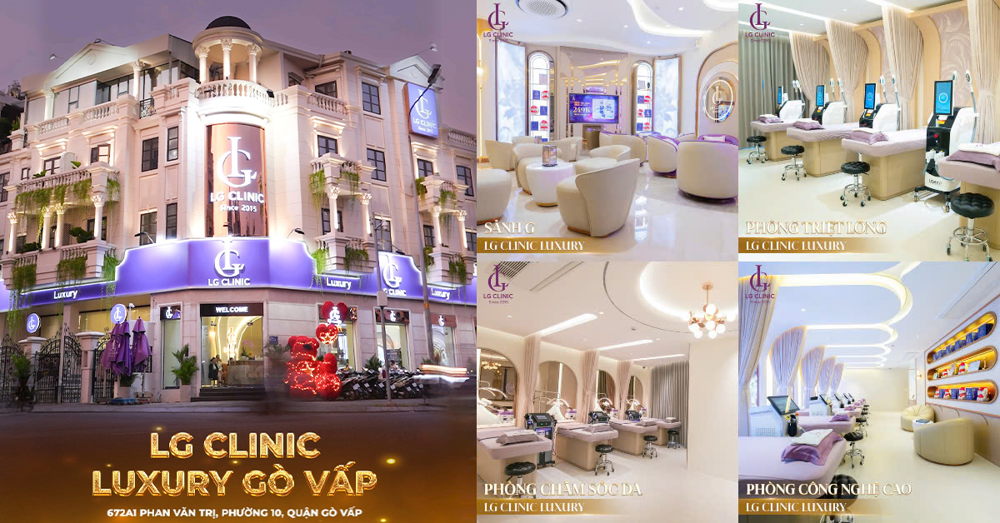
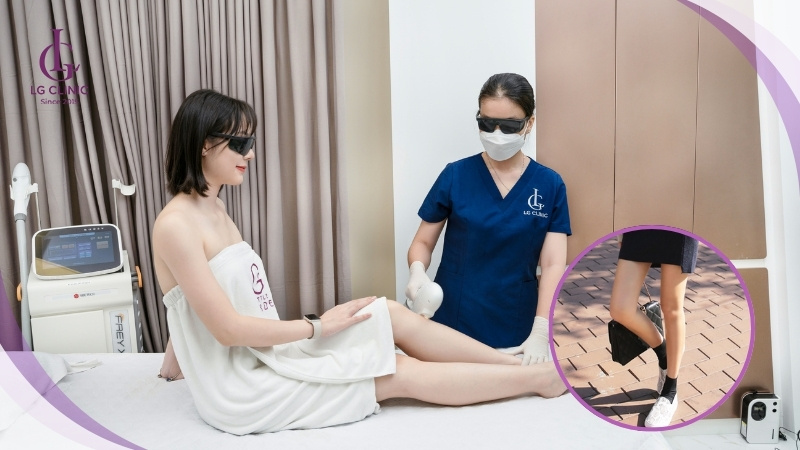

# SkinnyCare - Dự án Web Tĩnh

Một dự án web tĩnh đơn giản với nhiều trang HTML độc lập, được thiết kế để upload lên GitHub Pages.

## 📁 Cấu trúc dự án

```
├── index.html          # Trang chủ
├── about.html          # Trang giới thiệu
├── contact.html        # Trang liên hệ
├── style.css           # File CSS chung
├── main.js             # File JavaScript chung
└── README.md           # File hướng dẫn này
```

## ✨ Tính năng

- **Responsive Design**: Tương thích với mọi thiết bị
- **Navigation**: Thanh điều hướng nhất quán trên tất cả các trang
- **Contact Form**: Form liên hệ với validation cơ bản
- **Modern UI**: Giao diện hiện đại với Bootstrap 5
- **Animations**: Hiệu ứng chuyển động mượt mà
- **Scroll to Top**: Nút cuộn lên đầu trang
- **GitHub Pages Ready**: Sẵn sàng upload lên GitHub Pages
- **SkinnyCare Brand**: Thương hiệu chuyên về chăm sóc sắc đẹp

## 🚀 Cách sử dụng

### 1. Chạy locally
1. Tải về tất cả các file
2. Mở file `index.html` trong trình duyệt web
3. Hoặc sử dụng Live Server extension trong VS Code

### 2. Upload lên GitHub Pages
1. Tạo repository mới trên GitHub
2. Upload tất cả file lên repository
3. Vào Settings > Pages
4. Chọn Source: "Deploy from a branch"
5. Chọn branch: "main" và folder: "/ (root)"
6. Click "Save"

## 🎨 Tùy chỉnh

### Thay đổi nội dung
- Mở các file HTML và thay thế nội dung placeholder
- Cập nhật thông tin liên hệ trong `contact.html`
- Thay đổi tiêu đề và meta tags

### Tùy chỉnh giao diện
- Chỉnh sửa `style.css` để thay đổi màu sắc, font chữ
- Thay đổi Bootstrap theme bằng cách thay đổi CDN link
- Tùy chỉnh animations trong CSS

### Thêm tính năng
- Mở rộng `main.js` để thêm JavaScript functionality
- Thêm các trang mới bằng cách copy template từ trang hiện có
- Tích hợp với các service bên ngoài (Google Analytics, etc.)

## 🛠️ Công nghệ sử dụng

- **HTML5**: Cấu trúc trang web
- **CSS3**: Styling và animations
- **JavaScript (ES6+)**: Tương tác và functionality
- **Bootstrap 5**: Framework CSS cho responsive design
- **GitHub Pages**: Hosting miễn phí

## 📱 Responsive Breakpoints

- **Desktop**: > 992px
- **Tablet**: 768px - 991px
- **Mobile**: < 768px

## 🔧 Browser Support

- Chrome (latest)
- Firefox (latest)
- Safari (latest)
- Edge (latest)
- Internet Explorer 11+

## 📄 License

Dự án này được phát hành dưới MIT License. Bạn có thể tự do sử dụng, chỉnh sửa và phân phối.

## 🤝 Đóng góp

Nếu bạn muốn đóng góp vào dự án này:
1. Fork repository
2. Tạo feature branch
3. Commit changes
4. Push to branch
5. Tạo Pull Request

## 📞 Hỗ trợ

Nếu có bất kỳ câu hỏi nào, vui lòng tạo issue trên GitHub repository.

---

**Lưu ý**: Đây là một dự án demo đơn giản. Trong môi trường production, bạn nên:
- Thêm HTTPS
- Tối ưu hóa performance
- Thêm SEO meta tags
- Implement proper form handling
- Thêm error handling
- Sử dụng CDN cho assets 

<h2 id="lgclinic"><strong>Trải nghiệm triệt lông chân an toàn – hiệu quả cùng LG Clinic</strong></h2>
<p>Với hơn 8 chi nhánh trên toàn TP.HCM và Bình Dương, <strong>LG Clinic</strong> tự hào là địa chỉ làm đẹp được hàng ngàn khách hàng tin tưởng lựa chọn. Sở hữu hệ thống công nghệ hiện đại, đội ngũ kỹ thuật viên được đào tạo bài bản cùng không
gian chuẩn spa 5 sao, LG Clinic cam kết mang đến dịch vụ <a href="https://lgclinic.vn/triet-long-chan" target="_blank"><strong>triệt lông chân</strong></a> hiệu quả vượt trội – không đau rát, không tổn thương da và phù hợp với nhiều loại
da khác nhau.</p>

<p>Tại LG Clinic, bạn không chỉ được tư vấn chi tiết về quy trình triệt lông phù hợp mà còn được chăm sóc da chuyên sâu sau liệu trình, giúp làn da luôn mềm mại, sáng khỏe.</p>



<br> 👉 Tham khảo thêm về dịch vụ<br>

<a href="https://sites.google.com/view/triet-long-lg-clinic/triet-long-chan" target="_blank">triệt lông chân</a>,<br>
<a href="https://docs.google.com/spreadsheets/d/19aZpt6xklaEb04_iIO4nawVzE6JKAVkEiCDwR1RrIkE/" target="_blank">triệt lông chân</a>,<br>
<a href="https://lgclinic.vn/triet-long-vinh-vien-gia-bao-nhieu" target="_blank">giá triệt lông chân</a>,<br>
<a href="https://docs.google.com/forms/d/e/1FAIpQLSeoiNymOZ-XkYSW1MaPonstzHQU2g_iG6zcUYncccEEB9EvZw/viewform" target="_blank">triệt lông chân</a>,<br>
<a href="https://docs.google.com/document/d/1UoXQlZMIMw6FEHSr4k8I495ELAMX03gaB0bhj6U6DcI" target="_blank">triệt lông chân</a>,<br>
<a href="https://docs.google.com/presentation/d/13VLD8n8yjwXAc_2Fk_6b9nQTKPYIVEB5M6HiRyltnzY/" target="_blank">triệt lông chân</a>,<br>
<a href="https://docs.google.com/drawings/d/1okFSAmZzmXHA35T9R45yKDiHoq6xsZp9Wl4Vnf4ALUU/" target="_blank">triệt lông chân</a>,<br>
<a href="https://colab.research.google.com/drive/1DtGSZk4qA-z0NvDQqTVq6uxxku5FD1j1" target="_blank">triệt lông chân</a>,<br>
<a href="https://drive.google.com/file/d/1wvZ9V-DfMuM8W0jS88lywGmqLT5hf5aL/view" target="_blank">triệt lông chân</a>,<br>
<a href="https://calendar.google.com/calendar/embed?src=d8d4bc589ab066683d641ee6aedfb9347dd326e61bc018215cadde77cab22f80%40group.calendar.google.com&ctz=Asia%2FHo_Chi_Minh" target="_blank">triệt lông chân</a>,<br>
<a href="https://www.google.com/maps/d/edit?mid=1vhp25tho7y5VGUjTjlWRQbt9vkuDvpQ&ll=10.76894334443514%2C106.69052395000001&z=18" target="_blank">triệt lông chân</a>,<br>
<a href="https://earth.google.com/earth/d/1ID3zWN5BAXtDBEb-xpm4erZgzWfxRLWv" target="_blank">triệt lông chân</a>,<br>
<a href="https://groups.google.com/g/triet-long-chan/c/hUMAt-Tj2-k/m/Bn77nmOiAgAJ" target="_blank">triệt lông chân</a>,<br>
<a href="https://script.google.com/macros/s/AKfycbzdl_GUB2Dqmoqb1FhMqfJL7YW5bS0n5TSfudtntXB4nXq1ccd6vnNyQrSlblHepoqx/exec" target="_blank">triệt lông chân</a>,<br>
<a href="https://drive.google.com/drive/folders/1DSWMEsLwmvgAphZGfEEeV50AO4wKNVQi" target="_blank">triệt lông chân</a>.<br><br> 📞 Liên hệ ngay hotline <strong>1900 888 833</strong> hoặc đến chi nhánh gần bạn nhất để được tư vấn miễn phí!

 